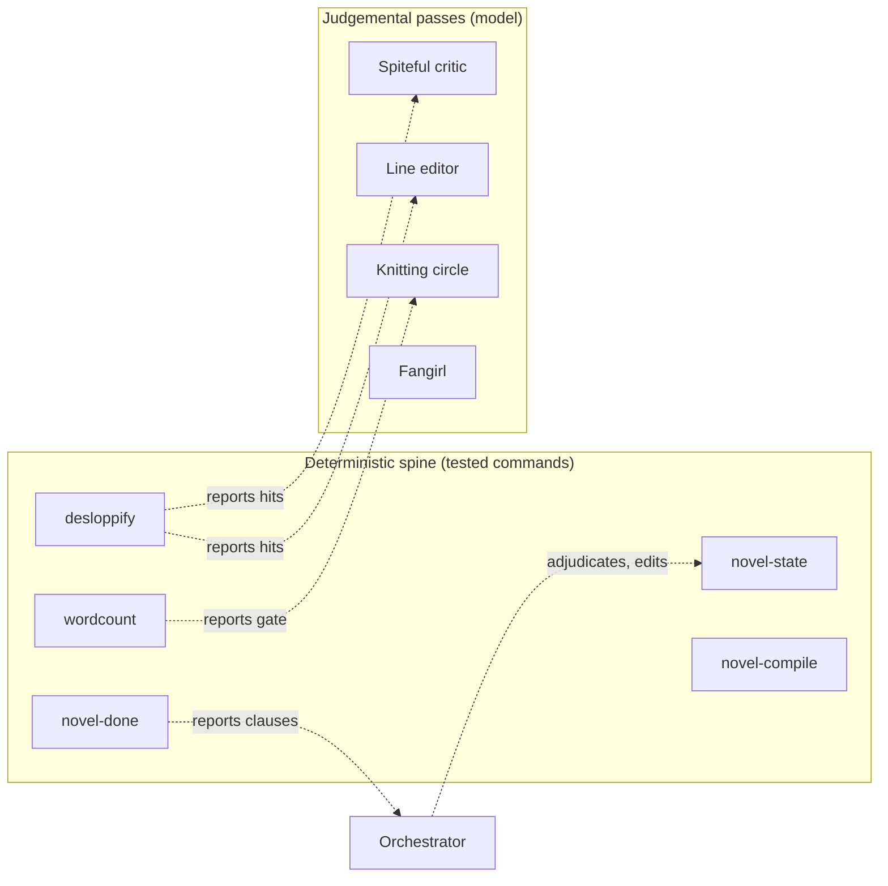
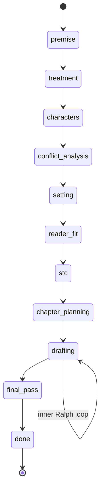
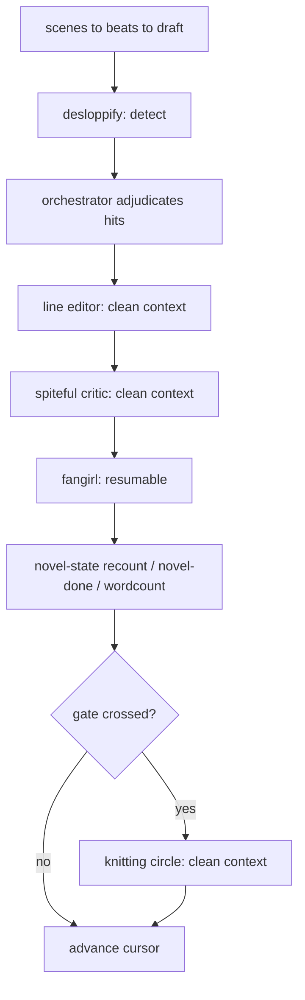

# novel-ralph harness — technical design

## Front matter

- **Status:** Draft, v0.1.
- **Audience:** Contributors implementing the deterministic spine, the
  skill maintainer, and reviewers evaluating the deterministic and judgemental
  boundary.
- **Scope:** The deterministic command spine for the `novel-ralph`
  skill, its shared interface contract, the configuration schemata it reads,
  and the clean-context sub-agent architecture for the judgemental passes.
  Implementation sequencing lives in `docs/roadmap.md`; the problem statement
  lives in `docs/terms-of-reference.md`.
- **Companion documents:**
  - `docs/terms-of-reference.md` — the problem space and scope.
  - `docs/roadmap.md` — phase, step, and task sequencing.
  - `docs/adr-001-deterministic-judgemental-boundary.md` through
    `docs/adr-005-command-surface-five-scripts.md` — the accepted decisions
    this design fixes: the boundary (§1), the TOML round-trip (§5.3), the
    interface contract (§3), the distribution form, and the command surface
    (§4).
  - `docs/scripting-standards.md` — Cyclopts, cuprum, and pathlib
    conventions.
  - `skill/novel-ralph/SKILL.md` and `skill/novel-ralph/references/` —
    the artefact under rebuild.
- **Date and version:** 2026-06-21, v0.1.

## 1. Problem and controlling decision

The `novel-ralph` skill describes a deterministic spine for a Ralph Loop
harness but ships it as pseudocode. A field report from an agent that ran the
skill records the consequence: the agent hand-rolled every deterministic
operation inconsistently each turn, and self-marked the judgemental passes too
gently because the authoring context cannot read its own prose as a cold reader
would. The terms of reference (`docs/terms-of-reference.md`) settles the
problem; this document settles the design.

One decision controls the rest. Every operation in the harness is either
**deterministic** — its correct result is a pure function of files on disk — or
**judgemental** — it requires reading prose for quality, intent, or earned
meaning. The two are placed on opposite sides of a hard line:

- Deterministic operations become **tested, installed commands** that
  run identically every turn and make zero narrative judgements.
- Judgemental operations go to a **peer-capability model**, and the
  adversarial ones go to a **clean-context sub-agent**, because independence
  from authorship is the point.

The following diagram shows the boundary. The left column is code; the right
column is model judgement; the dashed arrows are the only legal crossings — a
command *detects and reports*, then the model *adjudicates and edits*.



*Figure 1: The deterministic and judgemental boundary. Commands detect and
report; the model adjudicates and edits. No command makes a narrative
judgement; no judgemental pass mutates state directly.*

The non-negotiable rule, restated for emphasis: **scripts detect and report;
the model adjudicates.** A command that begins deciding whether a passive
construction is justified has crossed the line and is a defect.

## 2. Goals, non-goals, and verification scope

### 2.1 Goals

- Replace hand-rolled determinism with the five commands in §4.
- Give the commands a single machine-friendly interface contract (§3).
- Establish the validated `state.toml` schema and its invariants (§5)
  as the single source of truth for state and the done predicate.
- Make on-disk evidence authoritative and reconcilable (§5.4).
- Design — but, in v1, not yet build — the device ledger, the
  configurable AI-isms linter (§6), and the clean-context sub-agent
  architecture (§7).
- Correct the documented defects in the skill (§8).

### 2.2 Non-goals

- Building the judgemental architecture (§6.3, §7) in v1. v1 delivers
  determinism parity; those phases follow in the roadmap.
- Any narrative judgement inside a command.
- Changing the craft pipeline (Phases 0–9) except for defect fixes.
- Distribution as anything other than installed console-scripts in the
  `novel_ralph_skill` package.

### 2.3 Verification scope

Correctness here is not "the tests pass". The design names three verifiable
properties and the mechanism that enforces each:

- **State coherence.** Every write of `state.toml` satisfies the
  invariants in §5.2. Enforced by the `novel-state` validator, which refuses to
  write an invalid state, and demonstrated by property-based tests over
  generated states.
- **Predicate truthfulness.** `novel-done` returns "done" only when the
  predicate in §4.2 holds on disk. Enforced by deriving the predicate from the
  same code path the harness gates on, eliminating the two-source divergence in
  §8.
- **Compile fidelity.** `working/manuscript/compiled.md` equals the
  ordered concatenation of the chapter drafts. Enforced by
  `novel-compile --check`, which compares content hashes rather than header
  counts or word totals, and which shares one compile-and-hash routine with the
  `novel-done` compile clause (§4.2) so the two can never disagree.

The combinatorial surface is `command × output-mode × phase`. Each command runs
in two output modes (machine and human) across eleven phase states. §9 sets the
coverage strategy: snapshot tests pin the machine-mode JSON contract per
command, semantic assertions cover the phase-dependent branches, and the human
mode is asserted for presence rather than pinned.

## 3. Shared interface contract

All commands share one contract so the harness can invoke and gate them
uniformly. This resolves open question Q2 from the terms of reference and is
fixed in `docs/adr-003-shared-interface-contract.md`.

### 3.1 Output modes

Each command emits a single JSON object on stdout by default. The `--human`
flag switches to a human-readable rendering on stdout. Diagnostics go to stderr
in both modes. JSON is the default because the primary user is an agent, not a
person.

Every JSON payload carries a common envelope:

```json
{
  "command": "novel-done",
  "schema_version": 1,
  "ok": false,
  "working_dir": "working",
  "result": { "...": "command-specific" },
  "messages": ["compiled.md diverges from chapter drafts"]
}
```

- `ok` is the boolean the harness gates on; it mirrors the exit code.
- `result` holds the command-specific structured payload and every
  machine-actionable datum: the names of failed clauses, rule ids and hit
  counts, the list of divergent chapters, and reconciliation discrepancies. The
  harness reads `result`; it never parses prose.
- `messages` holds human-oriented notes for the `--human` rendering and for
  the log. It is never parsed and never required for gating, so a wording
  change cannot break the harness.

A mutator's success `result` names *what it changed*; the `violations` key is
reserved for the `check` query alone. This is the envelope-level expression of
command/query segregation (§3.3): a checker reports breached invariants in
`result.violations`, whereas a mutator reports the change it made and never
echoes the checker's read shape. Concretely, `init` returns the bootstrapped
`working_dir` and `slug`; `set-cursor` returns the cursor it set
(`current_chapter`, `current_scene`, `current_beat`); `advance-phase` returns
the transition (`from`, `to`); and the later `recount`/`reconcile` mutators
return the counts or discrepancies they wrote (§4.1, §5.4). `advance-phase`'s
`from` and `to` are *transition labels* describing the move, not on-disk schema
keys — `state.toml` has no `[from]`/`[to]` table; the persisted representation
is `phase.current` plus `phase.completed` (§5.1). A refusal carries no `result`
payload at all: the exit-3 channel emits only `messages` naming the breached
invariant (§3.2).

`set-cursor`'s `result` echoes the validated *input* arguments
(`current_chapter`, `current_scene`, `current_beat`) rather than re-reading them
back from the written document. This input-echo coupling is a deliberate choice,
not a latent assumption: validation runs *before* persistence (§3.4), so the
echoed scalars equal the persisted `[drafting]` cursor whenever the write
succeeds, and a write that would diverge is refused at exit 3 before it lands.
Re-reading the document to make the envelope structurally independent of the
input path would buy no extra guarantee here, because the cursor is a set of
plain scalars the mutator neither derives nor normalises on write. Should a
future mutator compute or normalise a value it persists — so the written form
could differ from the input — that mutator must report the *written* value, not
its input echo.

Three `schema_version` numbers coexist and evolve independently: the envelope's
(this contract), `state.toml`'s (§5.1), and each rule pack's (§6.1). The
separation is deliberate — the envelope version tracks the command contract,
the state version tracks the on-disk schema, and a pack version tracks its own
rule vocabulary — so revising a rule pack never forces a state migration, and
tightening the contract never invalidates a stored state. Each command stamps
the envelope version it emits; a consumer that reads an unexpected version
reports it rather than silently coercing it.

### 3.2 Exit codes

Exit codes follow UNIX convention so the harness can branch on them without
parsing JSON. The space distinguishes a *benign negative* — a predicate that is
simply not yet satisfied, on which the harness loops without intervention —
from an *actionable finding* the agent must adjudicate or repair. Conflating
the two was a documented defect: the harness could not tell "keep drafting"
from "stop and fix the compile" by exit code alone.

| Code | Meaning                                          | Harness response                  | Example                                                                  |
| ---- | ------------------------------------------------ | --------------------------------- | ------------------------------------------------------------------------ |
| 0    | Success; checker satisfied, mutator applied      | proceed                           | `novel-done` predicate holds; `recount` applied                          |
| 1    | Benign negative; predicate not yet satisfied     | continue the loop, no fix needed  | `novel-done` reports the novel is not yet done                           |
| 2    | Usage error                                      | stop; the invocation is wrong     | unknown subcommand, bad arguments                                        |
| 3    | State or input error                             | stop; recover state               | `state.toml` missing or unparseable; working dir absent                  |
| 4    | Actionable findings requiring agent intervention | adjudicate or repair, then re-run | desloppify finds violations; compile diverges; check finds a discrepancy |

A non-zero exit from a *checker* is a finding, not a crash; the JSON payload
explains it, and `result` carries the machine-actionable detail. A non-zero
exit from a *mutator* means the write did not happen. The split between codes 1
and 4 is the contract's load-bearing distinction: code 1 is the steady-state
"not finished" the loop expects every turn, while code 4 is the signal that a
deterministic detector has surfaced something only the model can resolve.

A mutator that refuses an invalid request is a third case, distinct from both:
`set-cursor` given an incoherent cursor, or `advance-phase` asked to skip or
reorder the phase enum, exits 3 (state or input error), never 1. The requested
mutation conflicts with the current state, so the harness must stop and bring
the state into a valid configuration — typically by completing the prerequisite
phase before re-attempting — rather than reading the refusal as the benign "not
yet done" of code 1 and looping on.

### 3.3 Command and query segregation

Read-only checkers are strictly separated from mutators so the harness can call
checkers freely without side effects:

| Class               | Commands and subcommands                                                                               | Writes                                         |
| ------------------- | ------------------------------------------------------------------------------------------------------ | ---------------------------------------------- |
| Checker (read-only) | `novel-done`, `novel-state check`, `wordcount`, `desloppify` (detect), `novel-compile --check`         | None                                           |
| Mutator             | `novel-state init` / `set-cursor` / `advance-phase` / `recount` / `reconcile`, `novel-compile` (write) | `state.toml`, `working/manuscript/compiled.md` |

### 3.4 Atomic writes

Every mutator writes via a temporary file in the target directory followed by
`Path.replace`, which is atomic on POSIX, per `docs/scripting-standards.md`.
The work the state describes is written to disk and verified before
`state.toml` is updated, and the log entry is appended last as the receipt. A
crash mid-mutation leaves the prior coherent state intact.

A single `Path.replace` is atomic, but a turn that touches several files — a
draft, a `done.flag`, a recount — is not atomic as a whole. To make a torn
multi-file turn recoverable, each mutator opens a `[pending_turn]` intent
record in `state.toml` *before* it touches any other file, naming the operation
and the paths it will write, and clears the record *after* every artefact is
written and verified. The record is written and cleared by the same atomic
discipline. On the next turn, an uncleared `[pending_turn]` is the signature of
a turn that died mid-write: `novel-state check` reads it, compares the named
paths against disk, and reports the reconciliation `novel-state reconcile` then
carries out (§5.4). The intent marker turns "some of my files landed and some
did not" from a silent corruption into a declared, inspectable state.

## 4. The deterministic commands

The five commands form the v1 spine. Each is a Cyclopts application exposed as
a console-script in `novel_ralph_skill`. None invokes an external process for
its core logic, so cuprum is required only where a command shells out (none do
in v1); filesystem work uses `pathlib`. The build-and-install proof
(`tests/test_console_scripts_e2e.py`) runs on POSIX only, per
`docs/adr-006-console-scripts-e2e-posix-policy.md`.

### 4.1 `novel-state`

All state mutation hides behind validated subcommands. Direct editing of
`state.toml` is eliminated.

| Subcommand      | Class   | Behaviour                                                                                                                                         |
| --------------- | ------- | ------------------------------------------------------------------------------------------------------------------------------------------------- |
| `init`          | Mutator | Create `working/` and an initial `state.toml` from title, slug, and target word count                                                             |
| `set-cursor`    | Mutator | Advance the drafting cursor (chapter, scene, beat); refuses incoherent cursors                                                                    |
| `advance-phase` | Mutator | Move `phase.current` to the next enum member; refuses skips and out-of-order completion                                                           |
| `recount`       | Mutator | Re-derive `word_counts.current` and `by_chapter` from chapter drafts on disk                                                                      |
| `check`         | Checker | Validate every invariant (§5.2), assert the chapter-manifest-to-disk bijection (§5.2), and report any divergence from disk (§5.4) without writing |
| `reconcile`     | Mutator | Write the disk-authoritative reconciliation `check` reports, bringing `state.toml` back into agreement with disk (§5.4)                           |

`recount` eliminates hand-typed word counts entirely: the count is a pure
aggregation over `working/manuscript/chapter-NN/draft.md` files, so the command
owns it. `advance-phase` enforces the phase enum order, making the silent phase
drift in the field report impossible; a skipping or out-of-order transition is
refused with exit 3, not the benign code 1 (§3.2), so a rejected advance cannot
be mistaken for progress. Advancing into `drafting` requires the chapter
manifest (§5.1) to be populated, so compilation always has an authoritative
ordering to follow.

State serialisation round-trips losslessly, preserving the on-disk formatting
and comments. The mechanism is open question Q1, resolved in §5.3.

### 4.2 `novel-done`

`novel-done` is the done predicate as code, replacing the pseudocode in
`done-conditions.md` and the ad-hoc shell the field report describes. It
returns a structured per-clause result and a meaningful exit code, so "check
done every turn" is one call. A satisfied predicate exits 0. An unsatisfied
predicate normally exits 1 — the benign negative the harness loops on — because
"not yet done" is not a finding to repair. The one exception is compile
divergence: when every clause except `compile_consistent` is satisfied, the
manuscript is otherwise complete and the only obstacle is a stale
`compiled.md`, which is an actionable finding a deterministic detector has
surfaced. In that case `novel-done` exits 4, matching `novel-compile --check`
(§4.3), so the harness regenerates the compile rather than looping. While any
drafting clause is still unmet, compile staleness is expected mid-draft and the
predicate stays at exit 1.

The predicate evaluates each clause against disk and reports which failed:

```json
{
  "command": "novel-done",
  "schema_version": 1,
  "ok": false,
  "result": {
    "phase_is_done": true,
    "final_pass_complete": false,
    "all_chapters_flagged": true,
    "knitting_gates_passed": true,
    "compile_consistent": true,
    "no_unresolved_blockers": true
  },
  "messages": ["final_pass_complete is false"]
}
```

The compile-divergence clause is real, not eyeballed: `novel-done` calls the
shared compile-and-hash routine (§4.3) to hash each
`working/manuscript/chapter-NN/draft.md`, build a fresh ordered compilation,
and compare its hash to `working/manuscript/compiled.md`. A stale compile whose
header count and word total coincidentally match is still caught. Because
`novel-done` and `novel-compile --check` call the same routine, they cannot
reach different verdicts on the same tree.

The `result` reports a single `compile_consistent` boolean, not the per-chapter
hashes it computed internally. The payload's size is therefore fixed: it does
not grow with the chapter count, so a hundred-chapter novel returns the same
bounded result as a three-chapter one.

### 4.3 `novel-compile`

`novel-compile` regenerates `working/manuscript/compiled.md` deterministically,
with consistent separators. The `--check` flag makes it a read-only checker
that reports divergence without writing, exiting 4 when the compile is stale so
the agent knows to regenerate.

Ordering is the part the field report and the review both flagged as
under-specified, so it is pinned here. The order is the **numeric chapter
index** taken from the zero-padded chapter directory names
(`working/manuscript/chapter-01`, `chapter-02`, …): a total, deterministic
order that requires no parsing of outline prose. The chapter manifest in
`state.toml` (§5.1) records the intended set of chapters — number, slug, title,
target words — written when chapter planning completes; `novel-state check`
asserts a bijection between manifest entries and on-disk chapter directories
(§5.2), so the manifest order and the directory index are guaranteed to agree
before any compile runs. This resolves assumption A5 from "ordering can be
derived" to "ordering *is* the zero-padded chapter index, validated against the
manifest": no prose is read, and a missing or non-bijective manifest is a loud
error (§10), not a silent mis-ordering.

The compile-and-hash work — concatenating drafts in index order and hashing the
result — lives in one shared routine that both `novel-compile` (write and
`--check`) and the `novel-done` compile clause (§4.2) call, so a divergence
verdict is computed identically wherever it is asked.

### 4.4 `desloppify`

`desloppify` runs the checklist's §6 high-frequency-offender table as a
versioned rule pack over a chapter or the whole manuscript. It emits structured
output per hit: phrase, count, density per N words, threshold, pass or fail,
and line numbers. This replaces the improvised `grep` the field report blames
for spurious whole-file output, non-zero-on-zero-match breakage, and glob
expansion mid-scan.

`desloppify` detects; it never edits and never judges. A hit is a report for
the model to adjudicate. A clean pass exits 0; a pass that finds violations
exits 4 — an actionable finding the agent must adjudicate, distinct from the
benign "not yet done" of code 1 and from the usage error (code 2) a malformed
rule pack raises. The rule-pack schema and the later-phase passive, filtering,
and AI-isms packs are designed in §6.

### 4.5 `wordcount`

`wordcount` reports, per chapter and cumulatively: words, percentage of target,
distance to the next knitting gate, and delta against the chapter target. The
field report computed all of this by hand, repeatedly. The knitting gate
triggers (30%, 50%, 80%) are derived here rather than noticed late, so the 80%
gate cannot fire at 85%.

## 5. State schema and invariants

### 5.1 Schema

The validated schema adopts the structure in
`skill/novel-ralph/references/state-layout.md`, omitting the dead per-chapter
`plan.md` reference that file still lists (§8). That reference file is the
authoritative source for the on-disk layout, and the design follows it exactly:
the manuscript lives under `working/manuscript/`, so the compiled output is
`working/manuscript/compiled.md`, each chapter is
`working/manuscript/chapter-NN/` (zero-padded, holding `draft.md` and, when
complete, `done.flag`), and the chapter outline is
`working/plan/chapter-outline.md`. Earlier drafts of this design referred to
`working/compiled.md` and `working/chapter-NN/`; those are wrong and do not
appear here.

The validated schema adds three fields beyond the reference structure:

- `[chapters]` — the chapter manifest: an ordered record of each planned
  chapter (number, slug, title, target words), written when chapter planning
  completes. It is the authoritative set against which `novel-state check`
  validates the on-disk chapter directories (§5.2), and its order mirrors the
  zero-padded directory index `novel-compile` uses (§4.3).
- `[drafting.critic].convergence_target` — the configured ceiling for
  `consecutive_clean` (default 1), replacing the hard-coded literal so the
  convergence bar can be raised without editing the validator (§5.2).
- `[pending_turn]` — the per-turn intent record (§3.4): the operation in
  flight and the paths it will write, present only while a multi-file mutation
  is mid-write and cleared once every artefact is verified.

The phase enum, in order:

```text
premise → treatment → characters → conflict-analysis → setting →
reader-fit → stc → chapter-planning → drafting → final-pass → done
```

The lifecycle is a strict forward march; `advance-phase` refuses any transition
that skips a member or completes phases out of order.



*Figure 2: The phase state machine. Phase `drafting` contains the inner Ralph
loop where most turns are spent; every other phase advances once.*

### 5.2 Invariants

`novel-state check` enforces these invariants and refuses to write a state that
violates them. The field report drove several of these out of range by hand;
validation makes that impossible:

- `phase.current` is a member of the phase enum.
- `phase.completed` is a prefix of the enum in order, with no gaps.
- `word_counts.by_chapter` sums to `word_counts.current`.
- `drafting.critic.consecutive_clean` lies within
  `0 ≤ consecutive_clean ≤ drafting.critic.convergence_target` and never
  exceeds the number of chapters drafted. The ceiling is the configured
  `convergence_target` (default 1), not a literal baked into the validator, so
  tightening the convergence bar is a state-field change rather than a code
  change. A `convergence_target` below 1 is itself rejected.
- The chapter manifest and the on-disk chapter directories are in bijection:
  every `[chapters]` entry has exactly one `working/manuscript/chapter-NN/`
  directory and vice versa, with numbering contiguous from 1 and no gaps. A
  `draft.md` with no manifest entry, or a manifest entry with no directory, is
  a violation — this is the disk-outline bijection that closes the
  ambiguous-ordering failure mode (§4.3).
- The drafting cursor is coherent: `current_scene` and `current_beat`
  are zero until their plans exist, and never reference a chapter past
  `current_chapter`.
- Each knitting gate boolean is consistent with the
  `word_counts.current / word_counts.target` ratio: a gate is true only if its
  threshold has been crossed.

### 5.3 TOML round-trip (resolves Q1)

State mutation must preserve the on-disk formatting and comments of
`state.toml`. The standard-library `tomllib` reads TOML but cannot write it.
The design selects `tomlkit`, which round-trips formatting and comments, over
an owned serialiser, because owning a comment-preserving TOML writer is
avoidable complexity for no benefit. This choice is hard to reverse once
mutators depend on it and is recorded in
`docs/adr-002-toml-round-trip-tomlkit.md`. The failed `tomli_w` snippet in the
reference is removed.

### 5.4 Disk-authoritative reconciliation

`novel-state check` and `novel-state reconcile` together implement the recovery
routine the skill currently leaves to the agent, split along the
checker/mutator boundary (§3.3). Disk is authoritative; `state.toml` describes
disk. `check` is strictly read-only: when it finds state merely *behind* disk —
for example, state claims a chapter is not done but a `done.flag` exists — it
reconstructs the intended state from on-disk evidence (which chapters carry
`done.flag`, what `compiled.md` contains), reports the discrepancy and the
reconciliation it implies in its payload, and exits 4 to signal an actionable
finding. `check` never writes. `reconcile` performs the write `check` reports,
bringing `state.toml` into agreement with disk; it computes the same
reconciliation independently rather than trusting a payload handed to it. No
file in `working/` is ever deleted.

Reconciliation is loud, never silent. Every discrepancy `reconcile` resolves is
both reported in `result` and appended to the log as a recovery entry, so a
state repair always leaves an audit trail rather than quietly mutating the
record. An uncleared `[pending_turn]` (§3.4) is reconciled the same way:
`check` reads the named paths and reports whether the partial write should be
completed or rolled back, according to which artefacts actually landed.
`reconcile` carries that out: completing writes the remaining artefacts so the
turn lands, while rolling back clears the `[pending_turn]` record and leaves
`state.toml` at the prior coherent point. Rolling back removes nothing — the
partial artefacts stay on disk, unreferenced by state, and are overwritten when
the turn is re-attempted, consistent with the guarantee that no file in
`working/` is ever deleted.

Some disk evidence is not merely behind but *contradictory*, and `check` must
not paper over it. A `done.flag` beside an empty or absent `draft.md`, or a
`compiled.md` that references a chapter with no `draft.md`, cannot be resolved
by trusting one field over another — the disk itself disagrees. In that case
`reconcile` refuses to repair: it reports the conflict in `result`, logs it,
and exits 4 so the agent adjudicates. The rule is that `reconcile` repairs only
where disk is internally consistent and the state is merely stale, and refuses
— loudly — where disk contradicts itself.

#### v1 reconciliation scope (roadmap task 2.3.2)

The "behind disk" reconstruction above names re-deriving the intended state
from *which chapters carry `done.flag` and what `compiled.md` contains*. v1's
disk-authoritative `reconcile` deliberately **narrows** that to the two
deterministically recomputable corrections it can make without fabricating an
agent judgement:

1. **Stale `[word_counts]` vs the drafts.** Done-ness is recorded in the
   per-chapter `word_counts.by_chapter` table, not a per-chapter `done`
   boolean. A settled tree whose table claims a done chapter the drafts do not
   corroborate (or a real `done.flag` over a draft the table under-counts) is
   detected by the `word-counts-match-drafts` disk-evidence invariant and
   repaired by re-deriving `[word_counts]` from the drafts — a recount fired by
   genuine disk evidence. This repair rewrites `[word_counts]` **only** and
   never `[gates]`: a knitting gate flag records "threshold crossed **and** the
   pass integrated and logged", an agent action disk does not store, so
   synthesising it would violate "disk is authoritative, never the reverse".
   Word-count reconciliation is therefore in scope **only for sub-threshold
   divergences** — where the recounted ratio crosses exactly the 30/50/80%
   thresholds the recorded gates already reflect — so the reconciled tree stays
   gate-consistent. A done-claim large enough to move a gate is reported and
   escalated, not silently re-projected.
2. **An uncleared `[pending_turn]`.** Completed (when every missing declared
   artefact is recomputable — `state.toml`/`log.md`) or rolled back (when an
   unrecoverable artefact, a `draft.md` or a `done.flag`, did not land),
   exactly as above.

The broader `done.flag`/`compiled.md`-driven reconstruction §5.4 describes — a
per-chapter done projection, or re-projecting gates from a recount — is
**deferred** to a later task. The `cursor-plan-present` break (the §5.2
invariant-6 "scene/beat zero until plans exist" sub-clause) is given §5.4
*refuse* semantics here: `reconcile` cannot synthesise a missing plan from disk
without fabricating planning prose, so it reports, logs, and exits 4 rather
than repairing — the same disposition as a contradiction.

## 6. Configuration-driven detection (designed; built post-v1)

The desloppify command reads versioned configuration so that detection rules
are data, not code. v1 ships the §6 offender table as the first rule pack; the
following packs are designed here and built in later roadmap phases.

### 6.1 Rule-pack schema

A rule pack is a versioned TOML file. Each rule carries a pattern, a threshold,
and a counting basis, so the structured output is uniform:

```toml
schema_version = 1
pack = "ai-isms"

[[rule]]
id = "load-bearing"
pattern = "\\bload-bearing\\b"
threshold = 0           # zero tolerance
basis = "manuscript"    # count across the whole manuscript

[[rule]]
id = "em-dash"
pattern = "—"
threshold = 5
basis = "per_page"      # density per N words
page_words = 300
```

### 6.2 AI-isms as versioned data (resolves Q5)

AI-isms are a moving target, so they are data, not logic. The `ai-isms.toml`
pack carries `schema_version` and is updated as new tells emerge without
touching the skill or the command. The 2026 set (for example "load-bearing", "a
testament to", "navigate the complexities") will be stale by 2027; the
maintainer owns the pack and its cadence. The concrete update cadence,
ownership, and membership policy are recorded in the developers' guide ("Rule
packs and the loader boundary", subsection "The ai-isms pack: cadence,
ownership, and membership"), which resolves Q5. Detection stays deterministic;
whether a flagged passive is justified remains the model's call.

### 6.3 Device ledger (resolves Q3)

The per-novel device ledger enforces rationing — the highest-risk manual work
in the field report, where a forgotten ration silently breaks the book's
discipline. It is a per-novel `device-ledger.toml` that `desloppify` enforces:

```toml
schema_version = 1

[[device]]
id = "sternum"
pattern = "\\bsternum\\b"
max_count = 3
allowed_chapters = [1, 3, 8]   # spent here; zero elsewhere

[[device]]
id = "bloom"
pattern = "\\bbloom\\b"
max_count = 1

[[device]]
id = "truth-of-the-thing"
pattern = "truth of the thing"
retired_after_chapter = 7

[[device]]
id = "stated-theme-bookend"
pattern = "<stated theme line>"
reserved_for_chapter = 12
```

The current count is recomputed from disk on every run, so the ledger cannot
drift from the manuscript. Detection is deterministic; the decision to spend a
device stays with the model.

## 7. Clean-context sub-agent architecture (designed; built post-v1)

The judgemental passes are designed here and sequenced after the deterministic
spine. The controlling reason is the skill's own most-named failure mode: a
context that wrote twelve chapters cannot attack them as a cold reader. The
split below assigns each pass to the context and model capability its job
requires.

| Pass              | Context                      | Model           | Rationale                                                                                                  |
| ----------------- | ---------------------------- | --------------- | ---------------------------------------------------------------------------------------------------------- |
| Spiteful critic   | Clean-context sub-agent      | Peer capability | Self-marking is softest here; a clean context cannot be seduced by knowing how hard a passage was to write |
| Line editor (new) | Clean-context sub-agent      | Peer capability | Micro mechanical weakness needs a reader, distinct from the critic's lens                                  |
| Knitting circle   | Clean-context sub-agent      | Peer capability | Six external voices only have value if genuinely external; one sub-agent produces the transcript           |
| Fangirl           | Resumable / persistent agent | Peer capability | Value is longitudinal; a fresh-context fangirl throws away the forward ledger of planted guns              |

Peer capability is a hard requirement for the adversarial reads. A weaker model
produces generic critique — "consider varying sentence length" — which is
competent-slop criticism that wastes a pass, the exact failure the skill exists
to prevent. Mechanical verification is not delegated to a weaker model; it is
delegated to a script (§4).

In every case the sub-agent produces notes; adjudication and edits return to
the orchestrator. No sub-agent mutates state or the manuscript directly.

### 7.1 The line editor and its boundary (resolves Q4)

The line editor is a new pass with a copy-editor persona, distinct from the
spiteful critic, running after `desloppify` and before the critic. It
adjudicates the micro-level: passive-voice hits, filtering words ("she saw /
felt / noticed X"), and micro show-don't-tell ("she was angry" versus rendered
anger).

The boundary between the line editor and the critic is a single test:

> Can the fix be done by rewriting a sentence, or does it require
> restaging a scene, adding a beat, or cutting an assertion a whole
> chapter failed to earn?

Sentence-level fixes belong to the line editor. Scene-level fixes — macro
show-don't-tell, a chapter that asserts a character is grieving instead of
dramatising it — belong to the critic and knitting circle. Folding "fix the
passive voice" into the spiteful critic dilutes both jobs, so they stay
separate prompts with separate outputs.

### 7.2 Per-chapter pipeline

The full per-chapter pipeline weaves the deterministic commands through the
judgemental passes:



*Figure 3: The per-chapter pipeline. Detection (`desloppify`, `wordcount`) and
state operations are scripted; adjudication and the critic, line-editor,
knitting, and fangirl reads are model judgement.*

## 8. Skill defects the rebuild corrects

The rebuild corrects the defects the field report identified, all in the prose
layer the commands replace. The reference files still carry these defects; the
corrections to `SKILL.md` and `state-layout.md` are owned by roadmap task
6.2.3, which runs once the commands the prose must point at exist. Until that
task lands, this section is the record of what is wrong, not a claim that the
reference files are already fixed.

- **Phase mislabel.** `SKILL.md:107` calls drafting "Phase 7"; the drafting
  section is Phase 8 (`SKILL.md:304`). Roadmap task 6.2.3 corrects the label in
  `SKILL.md`.
- **Two-source done predicate.** The short-form predicate in `SKILL.md`
  omits `final_pass_complete` and the gate booleans that the long-form
  predicate in `done-conditions.md` requires. `novel-done` becomes the single
  source of truth; roadmap task 6.2.3 reduces both prose copies to a pointer at
  the command.
- **Dead `plan.md` spec.** `state-layout.md:38` documents a per-chapter
  `plan.md` the workflow never produces and nothing checks. The validated
  schema omits it (§5.1); roadmap task 6.2.3 removes the stale entry from
  `state-layout.md`.

## 9. Verification strategy

The commands are verified with `pytest`, per `AGENTS.md`, with a deliberate
division of method matched to what each property needs. The method is matched
to the command, not applied uniformly: `novel-state` earns the full battery
because it carries the schema, the invariants, and the round-trip; `wordcount`
and `desloppify` are pure aggregations over text and need only snapshot
coverage of their envelope plus a handful of boundary examples (a manuscript
exactly on a gate, a pack hit exactly at threshold), not a property-based or
behavioural suite of their own. Imposing all four methods on every command
would buy confidence the simpler commands do not need.

- **Property-based tests (`hypothesis`)** over the state validator:
  generated states confirm that `novel-state check` accepts exactly the states
  satisfying §5.2 and rejects the rest, and that a no-op `recount` preserves
  formatting and comments (the §5.3 round-trip property).
- **Snapshot tests** pin the machine-mode JSON envelope per command,
  with timestamps, absolute paths, and slugs normalised, so a snapshot failure
  identifies a real contract change rather than churn.
- **Behavioural tests (`pytest-bdd`)** cover the harness-facing flows:
  a stale `compiled.md` is caught by `novel-done`; an out-of-order
  `advance-phase` is refused; a knitting gate triggers at the right threshold.
- **Combinatorial coverage** of `command × output-mode × phase` is
  bounded: machine mode is snapshotted, human mode is asserted for presence,
  and phase-dependent branches carry semantic assertions. The gaps — for
  example, exhaustive cross-products of every phase with every command — are
  carried knowingly rather than silently.
- **CLI error-path tests** assert the exit-code contract (§3.2) at its
  boundaries, because the codes are an externally visible contract the harness
  branches on, not an implementation detail. Each command is driven with a
  malformed invocation (unknown subcommand or bad arguments → exit 2) and a
  broken environment (missing or unparseable `state.toml`, absent working dir →
  exit 3). `desloppify`, whose rule-pack loader and validator are the surface
  most exposed to bad input, additionally covers a malformed rule pack (an
  invalid pattern or schema violation → exit 2, §4.4) and an unreadable or
  absent pack file (→ exit 3), plus the 0-versus-4 boundary directly: a clean
  manuscript exits 0 and one violation past threshold exits 4. `wordcount`
  covers its own gate-boundary envelope. The 1-versus-4 distinction is asserted
  on `novel-done`: a mid-draft tree exits 1, while an otherwise-complete tree
  with only a stale `compiled.md` exits 4 (§4.2).

External executables, where any command grows them, are mocked with `cmd-mox`
at the cuprum catalogue boundary; v1 commands shell out to nothing, so the
suite touches only the filesystem under `tmp_path`.

## 10. Failure modes

- **`state.toml` unparseable.** Commands exit 3 with a message rather
  than a stack trace. Recovery is `novel-state check` reporting the
  reconstruction from disk and `novel-state reconcile` applying it (§5.4).
- **Chapter manifest missing or non-bijective during compile.**
  `novel-compile` exits 3 when `[chapters]` is absent or empty — ordering has
  no authoritative source, so the agent must complete chapter planning first —
  and `novel-state check` exits 4 when the manifest and the on-disk directories
  are not in bijection (§5.2), naming the orphaned draft or manifest entry.
- **Contradictory disk evidence.** When disk disagrees with itself — a
  `done.flag` beside an empty `draft.md`, or a `compiled.md` referencing an
  absent chapter — `novel-state check` refuses to auto-repair, reports the
  conflict, logs it, and exits 4 for the agent to adjudicate (§5.4).
- **Torn multi-file turn.** An uncleared `[pending_turn]` record from a
  crashed turn (§3.4) is detected by `novel-state check`;
  `novel-state reconcile` completes the partial write or rolls it back
  according to what landed on disk — overwriting, never deleting, any partial
  artefact — and logs the recovery.
- **Rule-pack pattern invalid.** `desloppify` exits 2, naming the
  offending rule id, so a malformed `ai-isms.toml` fails loudly rather than
  silently skipping a tell.
- **Device ledger drift.** Impossible by construction: current counts
  are recomputed from disk every run, never stored.
- **Sub-agent persona degradation.** When the critic praises or the
  fangirl gushes, the orchestrator re-issues the persona prompt verbatim and
  re-runs, per the degradation guards already in `critic-personas.md`. This is
  a model-side guard, outside the command contract.

## 11. References

- `docs/terms-of-reference.md` — problem space, goals, open questions.
- `skill/novel-ralph/references/state-layout.md`,
  `done-conditions.md`, `desloppify-checklist.md`, `critic-personas.md` — the
  prose layer under rebuild.
- `docs/scripting-standards.md` — Cyclopts, cuprum, pathlib, and
  testing conventions.
- Agent field report supplied with the rebuild request, 2026-06-21.
