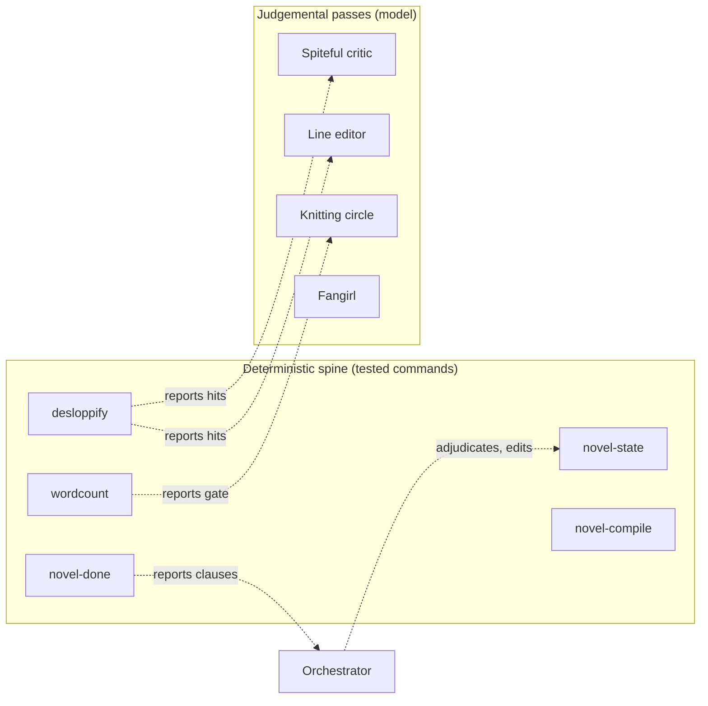
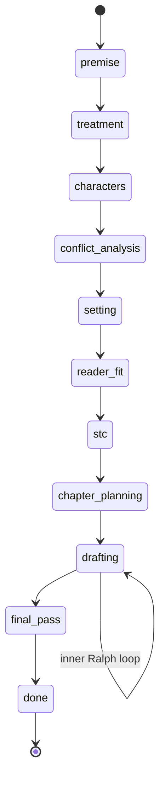
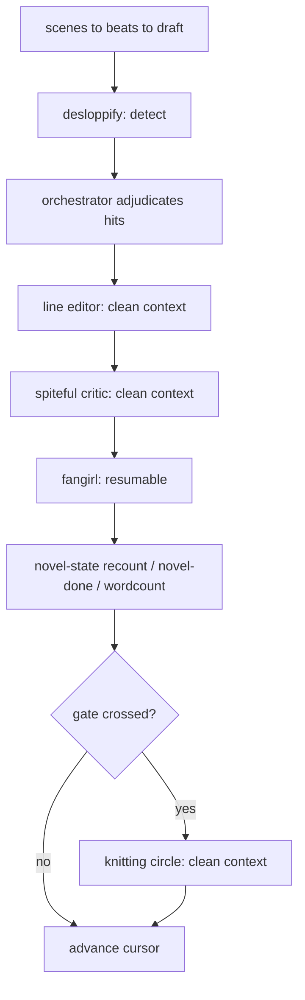

# novel-ralph harness — technical design

## Front matter

- **Status:** Draft, v0.1.
- **Audience:** Contributors implementing the deterministic spine, the
  skill maintainer, and reviewers evaluating the deterministic and judgemental
  boundary.
- **Scope:** The deterministic command spine for the `novel-ralph`
  skill, its shared interface contract, the configuration schemata it reads,
  and the clean-context sub-agent architecture for the judgemental passes.
  Implementation sequencing lives in `docs/roadmap.md`; the problem statement
  lives in `docs/terms-of-reference.md`.
- **Companion documents:**
  - `docs/terms-of-reference.md` — the problem space and scope.
  - `docs/roadmap.md` — phase, step, and task sequencing.
  - `docs/scripting-standards.md` — Cyclopts, cuprum, and pathlib
    conventions.
  - `skill/novel-ralph/SKILL.md` and `skill/novel-ralph/references/` —
    the artefact under rebuild.
- **Date and version:** 2026-06-21, v0.1.

## 1. Problem and controlling decision

The `novel-ralph` skill describes a deterministic spine for a Ralph Loop
harness but ships it as pseudocode. A field report from an agent that ran the
skill records the consequence: the agent hand-rolled every deterministic
operation inconsistently each turn, and self-marked the judgemental passes too
gently because the authoring context cannot read its own prose as a cold reader
would. The terms of reference (`docs/terms-of-reference.md`) settles the
problem; this document settles the design.

One decision controls the rest. Every operation in the harness is either
**deterministic** — its correct result is a pure function of files on disk — or
**judgemental** — it requires reading prose for quality, intent, or earned
meaning. The two are placed on opposite sides of a hard line:

- Deterministic operations become **tested, installed commands** that
  run identically every turn and make zero narrative judgements.
- Judgemental operations go to a **peer-capability model**, and the
  adversarial ones go to a **clean-context sub-agent**, because independence
  from authorship is the point.

The following diagram shows the boundary. The left column is code; the right
column is model judgement; the dashed arrows are the only legal crossings — a
command *detects and reports*, then the model *adjudicates and edits*.



*Figure 1: The deterministic and judgemental boundary. Commands detect and
report; the model adjudicates and edits. No command makes a narrative
judgement; no judgemental pass mutates state directly.*

The non-negotiable rule, restated for emphasis: **scripts detect and report;
the model adjudicates.** A command that begins deciding whether a passive
construction is justified has crossed the line and is a defect.

## 2. Goals, non-goals, and verification scope

### 2.1 Goals

- Replace hand-rolled determinism with the five commands in §4.
- Give the commands a single machine-friendly interface contract (§3).
- Establish the validated `state.toml` schema and its invariants (§5)
  as the single source of truth for state and the done predicate.
- Make on-disk evidence authoritative and reconcilable (§5.4).
- Design — but, in v1, not yet build — the device ledger, the
  configurable AI-isms linter (§6), and the clean-context sub-agent
  architecture (§7).
- Correct the documented defects in the skill (§8).

### 2.2 Non-goals

- Building the judgemental architecture (§6.3, §7) in v1. v1 delivers
  determinism parity; those phases follow in the roadmap.
- Any narrative judgement inside a command.
- Changing the craft pipeline (Phases 0–9) except for defect fixes.
- Distribution as anything other than installed console-scripts in the
  `novel_ralph_skill` package.

### 2.3 Verification scope

Correctness here is not "the tests pass". The design names three verifiable
properties and the mechanism that enforces each:

- **State coherence.** Every write of `state.toml` satisfies the
  invariants in §5.2. Enforced by the `novel-state` validator, which refuses to
  write an invalid state, and demonstrated by property-based tests over
  generated states.
- **Predicate truthfulness.** `novel-done` returns "done" only when the
  predicate in §4.2 holds on disk. Enforced by deriving the predicate from the
  same code path the harness gates on, eliminating the two-source divergence in
  §8.
- **Compile fidelity.** `compiled.md` equals the ordered concatenation
  of chapter drafts. Enforced by `novel-compile --check`, which compares
  content hashes rather than header counts or word totals.

The combinatorial surface is `command × output-mode × phase`. Each command runs
in two output modes (machine and human) across eleven phase states. §9 sets the
coverage strategy: snapshot tests pin the machine-mode JSON contract per
command, semantic assertions cover the phase-dependent branches, and the human
mode is asserted for presence rather than pinned.

## 3. Shared interface contract

All commands share one contract so the harness can invoke and gate them
uniformly. This resolves open question Q2 from the terms of reference.

### 3.1 Output modes

Each command emits a single JSON object on stdout by default. The `--human`
flag switches to a human-readable rendering on stdout. Diagnostics go to stderr
in both modes. JSON is the default because the primary user is an agent, not a
person.

Every JSON payload carries a common envelope:

```json
{
  "command": "novel-done",
  "schema_version": 1,
  "ok": false,
  "working_dir": "working",
  "result": { "...": "command-specific" },
  "messages": ["compiled.md diverges from chapter drafts"]
}
```

- `ok` is the boolean the harness gates on; it mirrors the exit code.
- `result` holds the command-specific structured payload.
- `messages` holds human-oriented notes; never required for gating.

### 3.2 Exit codes

Exit codes follow UNIX convention so the harness can branch on them without
parsing JSON:

| Code | Meaning                                                | Example                                                        |
| ---- | ------------------------------------------------------ | -------------------------------------------------------------- |
| 0    | Success; checkers report pass, mutators report applied | `novel-done` predicate holds; `recount` applied                |
| 1    | Actionable negative result                             | predicate fails; desloppify finds violations; compile diverges |
| 2    | Usage error                                            | unknown subcommand, bad arguments                              |
| 3    | State or input error                                   | `state.toml` missing or unparseable; working dir absent        |

A non-zero exit from a *checker* is a finding, not a crash; the JSON payload
explains it. A non-zero exit from a *mutator* means the write did not happen.

### 3.3 Command and query segregation

Read-only checkers are strictly separated from mutators so the harness can call
checkers freely without side effects:

| Class               | Commands and subcommands                                                                       | Writes                      |
| ------------------- | ---------------------------------------------------------------------------------------------- | --------------------------- |
| Checker (read-only) | `novel-done`, `novel-state check`, `wordcount`, `desloppify` (detect), `novel-compile --check` | None                        |
| Mutator             | `novel-state init` / `set-cursor` / `advance-phase` / `recount`, `novel-compile` (write)       | `state.toml`, `compiled.md` |

### 3.4 Atomic writes

Every mutator writes via a temporary file in the target directory followed by
`Path.replace`, which is atomic on POSIX, per `docs/scripting-standards.md`.
The work the state describes is written to disk and verified before
`state.toml` is updated, and the log entry is appended last as the receipt. A
crash mid-mutation leaves the prior coherent state intact.

## 4. The deterministic commands

The five commands form the v1 spine. Each is a Cyclopts application exposed as
a console-script in `novel_ralph_skill`. None invokes an external process for
its core logic, so cuprum is required only where a command shells out (none do
in v1); filesystem work uses `pathlib`.

### 4.1 `novel-state`

All state mutation hides behind validated subcommands. Direct editing of
`state.toml` is eliminated.

| Subcommand      | Class   | Behaviour                                                                               |
| --------------- | ------- | --------------------------------------------------------------------------------------- |
| `init`          | Mutator | Create `working/` and an initial `state.toml` from title, slug, and target word count   |
| `set-cursor`    | Mutator | Advance the drafting cursor (chapter, scene, beat); refuses incoherent cursors          |
| `advance-phase` | Mutator | Move `phase.current` to the next enum member; refuses skips and out-of-order completion |
| `recount`       | Mutator | Re-derive `word_counts.current` and `by_chapter` from chapter drafts on disk            |
| `check`         | Checker | Validate every invariant (§5.2) and reconcile state against disk (§5.4)                 |

`recount` eliminates hand-typed word counts entirely: the count is a pure
aggregation over `draft.md` files, so the command owns it. `advance-phase`
enforces the phase enum order, making the silent phase drift in the field
report impossible.

State serialisation round-trips losslessly, preserving the on-disk formatting
and comments. The mechanism is open question Q1, resolved in §5.3.

### 4.2 `novel-done`

`novel-done` is the done predicate as code, replacing the pseudocode in
`done-conditions.md` and the ad-hoc shell the field report describes. It
returns a structured per-clause result and a meaningful exit code, so "check
done every turn" is one call.

The predicate evaluates each clause against disk and reports which failed:

```json
{
  "command": "novel-done",
  "schema_version": 1,
  "ok": false,
  "result": {
    "phase_is_done": true,
    "final_pass_complete": false,
    "all_chapters_flagged": true,
    "knitting_gates_passed": true,
    "compile_consistent": true,
    "no_unresolved_blockers": true
  },
  "messages": ["final_pass_complete is false"]
}
```

The compile-divergence clause is real, not eyeballed: `novel-done` hashes each
`draft.md`, concatenates a fresh ordered compilation, and compares its hash to
`compiled.md`. A stale compile whose header count and word total coincidentally
match is still caught.

### 4.3 `novel-compile`

`novel-compile` regenerates `compiled.md` deterministically, ordered by the
chapter outline rather than by directory glob, with consistent separators. The
`--check` flag makes it a read-only checker that reports divergence without
writing. This resolves assumption A5: ordering comes from the outline, so it is
unambiguous.

### 4.4 `desloppify`

`desloppify` runs the checklist's §6 high-frequency-offender table as a
versioned rule pack over a chapter or the whole manuscript. It emits structured
output per hit: phrase, count, density per N words, threshold, pass or fail,
and line numbers. This replaces the improvised `grep` the field report blames
for spurious whole-file output, non-zero-on-zero-match breakage, and glob
expansion mid-scan.

`desloppify` detects; it never edits and never judges. A hit is a report for
the model to adjudicate. The rule-pack schema and the later-phase passive,
filtering, and AI-isms packs are designed in §6.

### 4.5 `wordcount`

`wordcount` reports, per chapter and cumulatively: words, percentage of target,
distance to the next knitting gate, and delta against the chapter target. The
field report computed all of this by hand, repeatedly. The knitting gate
triggers (30%, 50%, 80%) are derived here rather than noticed late, so the 80%
gate cannot fire at 85%.

## 5. State schema and invariants

### 5.1 Schema

The validated schema adopts the structure in
`skill/novel-ralph/references/state-layout.md`, with the dead per-chapter
`plan.md` reference removed (§8). The phase enum, in order:

```text
premise → treatment → characters → conflict-analysis → setting →
reader-fit → stc → chapter-planning → drafting → final-pass → done
```

The lifecycle is a strict forward march; `advance-phase` refuses any transition
that skips a member or completes phases out of order.



*Figure 2: The phase state machine. Phase `drafting` contains the inner Ralph
loop where most turns are spent; every other phase advances once.*

### 5.2 Invariants

`novel-state check` enforces these invariants and refuses to write a state that
violates them. The field report drove several of these out of range by hand;
validation makes that impossible:

- `phase.current` is a member of the phase enum.
- `phase.completed` is a prefix of the enum in order, with no gaps.
- `word_counts.by_chapter` sums to `word_counts.current`.
- `drafting.critic.consecutive_clean` lies within its documented range
  (0–1 unless the schema raises it deliberately) and never exceeds the number
  of chapters drafted.
- The drafting cursor is coherent: `current_scene` and `current_beat`
  are zero until their plans exist, and never reference a chapter past
  `current_chapter`.
- Each knitting gate boolean is consistent with the
  `word_counts.current / word_counts.target` ratio: a gate is true only if its
  threshold has been crossed.

### 5.3 TOML round-trip (resolves Q1)

State mutation must preserve the on-disk formatting and comments of
`state.toml`. The standard-library `tomllib` reads TOML but cannot write it.
The design selects `tomlkit`, which round-trips formatting and comments, over
an owned serialiser, because owning a comment-preserving TOML writer is
avoidable complexity for no benefit. This choice is hard to reverse once
mutators depend on it and is recorded as an ADR candidate (terms of reference,
Appendix B). The failed `tomli_w` snippet in the current reference is removed.

### 5.4 Disk-authoritative reconciliation

`novel-state check` implements the recovery routine the skill currently leaves
to the agent. Disk is authoritative; `state.toml` describes disk. When `check`
finds state incoherent with disk — for example, state claims a chapter is done
but no `done.flag` exists — it reconstructs the intended state from on-disk
evidence (which chapters carry `done.flag`, what `compiled.md` contains),
reports the discrepancy in its payload, and, when run as a mutator variant,
writes the reconciled state. No file in `working/` is ever deleted.

## 6. Configuration-driven detection (designed; built post-v1)

The desloppify command reads versioned configuration so that detection rules
are data, not code. v1 ships the §6 offender table as the first rule pack; the
following packs are designed here and built in later roadmap phases.

### 6.1 Rule-pack schema

A rule pack is a versioned TOML file. Each rule carries a pattern, a threshold,
and a counting basis, so the structured output is uniform:

```toml
schema_version = 1
pack = "ai-isms"

[[rule]]
id = "load-bearing"
pattern = "\\bload-bearing\\b"
threshold = 0           # zero tolerance
basis = "manuscript"    # count across the whole manuscript

[[rule]]
id = "em-dash"
pattern = "—"
threshold = 5
basis = "per_page"      # density per N words
page_words = 300
```

### 6.2 AI-isms as versioned data (resolves Q5)

AI-isms are a moving target, so they are data, not logic. The `ai-isms.toml`
pack carries `schema_version` and is updated as new tells emerge without
touching the skill or the command. The 2026 set (for example "load-bearing", "a
testament to", "navigate the complexities") will be stale by 2027; the
maintainer owns the pack and its cadence. Detection stays deterministic;
whether a flagged passive is justified remains the model's call.

### 6.3 Device ledger (resolves Q3)

The per-novel device ledger enforces rationing — the highest-risk manual work
in the field report, where a forgotten ration silently breaks the book's
discipline. It is a per-novel `device-ledger.toml` that `desloppify` enforces:

```toml
schema_version = 1

[[device]]
id = "sternum"
pattern = "\\bsternum\\b"
max_count = 3
allowed_chapters = [1, 3, 8]   # spent here; zero elsewhere

[[device]]
id = "bloom"
pattern = "\\bbloom\\b"
max_count = 1

[[device]]
id = "truth-of-the-thing"
pattern = "truth of the thing"
retired_after_chapter = 7

[[device]]
id = "stated-theme-bookend"
pattern = "<stated theme line>"
reserved_for_chapter = 12
```

The current count is recomputed from disk on every run, so the ledger cannot
drift from the manuscript. Detection is deterministic; the decision to spend a
device stays with the model.

## 7. Clean-context sub-agent architecture (designed; built post-v1)

The judgemental passes are designed here and sequenced after the deterministic
spine. The controlling reason is the skill's own most-named failure mode: a
context that wrote twelve chapters cannot attack them as a cold reader. The
split below assigns each pass to the context and model capability its job
requires.

| Pass              | Context                      | Model           | Rationale                                                                                                  |
| ----------------- | ---------------------------- | --------------- | ---------------------------------------------------------------------------------------------------------- |
| Spiteful critic   | Clean-context sub-agent      | Peer capability | Self-marking is softest here; a clean context cannot be seduced by knowing how hard a passage was to write |
| Line editor (new) | Clean-context sub-agent      | Peer capability | Micro mechanical weakness needs a reader, distinct from the critic's lens                                  |
| Knitting circle   | Clean-context sub-agent      | Peer capability | Six external voices only have value if genuinely external; one sub-agent produces the transcript           |
| Fangirl           | Resumable / persistent agent | Peer capability | Value is longitudinal; a fresh-context fangirl throws away the forward ledger of planted guns              |

Peer capability is a hard requirement for the adversarial reads. A weaker model
produces generic critique — "consider varying sentence length" — which is
competent-slop criticism that wastes a pass, the exact failure the skill exists
to prevent. Mechanical verification is not delegated to a weaker model; it is
delegated to a script (§4).

In every case the sub-agent produces notes; adjudication and edits return to
the orchestrator. No sub-agent mutates state or the manuscript directly.

### 7.1 The line editor and its boundary (resolves Q4)

The line editor is a new pass with a copy-editor persona, distinct from the
spiteful critic, running after `desloppify` and before the critic. It
adjudicates the micro-level: passive-voice hits, filtering words ("she saw /
felt / noticed X"), and micro show-don't-tell ("she was angry" versus rendered
anger).

The boundary between the line editor and the critic is a single test:

> Can the fix be done by rewriting a sentence, or does it require
> restaging a scene, adding a beat, or cutting an assertion a whole
> chapter failed to earn?

Sentence-level fixes belong to the line editor. Scene-level fixes — macro
show-don't-tell, a chapter that asserts a character is grieving instead of
dramatising it — belong to the critic and knitting circle. Folding "fix the
passive voice" into the spiteful critic dilutes both jobs, so they stay
separate prompts with separate outputs.

### 7.2 Per-chapter pipeline

The full per-chapter pipeline weaves the deterministic commands through the
judgemental passes:



*Figure 3: The per-chapter pipeline. Detection (`desloppify`, `wordcount`) and
state operations are scripted; adjudication and the critic, line-editor,
knitting, and fangirl reads are model judgement.*

## 8. Skill defects corrected

The rebuild corrects the defects the field report identified, all in the prose
layer the commands replace:

- **Phase mislabel.** `SKILL.md:110` calls drafting "Phase 7"; it is
  Phase 8. Corrected.
- **Two-source done predicate.** The short-form predicate in `SKILL.md`
  omits `final_pass_complete` and the gate booleans that the long-form
  predicate in `done-conditions.md` requires. `novel-done` becomes the single
  source of truth; both prose copies are reduced to a pointer at the command.
- **Dead `plan.md` spec.** `state-layout.md:39` documents a per-chapter
  `plan.md` the workflow never produces and nothing checks. Removed from the
  schema and the layout.

## 9. Verification strategy

The commands are verified with `pytest`, per `AGENTS.md`, with a deliberate
division of method matched to what each property needs:

- **Property-based tests (`hypothesis`)** over the state validator:
  generated states confirm that `novel-state check` accepts exactly the states
  satisfying §5.2 and rejects the rest, and that a no-op `recount` preserves
  formatting and comments (the §5.3 round-trip property).
- **Snapshot tests** pin the machine-mode JSON envelope per command,
  with timestamps, absolute paths, and slugs normalised, so a snapshot failure
  identifies a real contract change rather than churn.
- **Behavioural tests (`pytest-bdd`)** cover the harness-facing flows:
  a stale `compiled.md` is caught by `novel-done`; an out-of-order
  `advance-phase` is refused; a knitting gate triggers at the right threshold.
- **Combinatorial coverage** of `command × output-mode × phase` is
  bounded: machine mode is snapshotted, human mode is asserted for presence,
  and phase-dependent branches carry semantic assertions. The gaps — for
  example, exhaustive cross-products of every phase with every command — are
  carried knowingly rather than silently.

External executables, where any command grows them, are mocked with `cmd-mox`
at the cuprum catalogue boundary; v1 commands shell out to nothing, so the
suite touches only the filesystem under `tmp_path`.

## 10. Failure modes

- **`state.toml` unparseable.** Commands exit 3 with a message rather
  than a stack trace. Recovery is `novel-state check` reconstructing from disk
  (§5.4).
- **Outline missing during compile.** `novel-compile` exits 3; ordering
  cannot be derived without the outline (A5). The agent must complete chapter
  planning first.
- **Rule-pack pattern invalid.** `desloppify` exits 2, naming the
  offending rule id, so a malformed `ai-isms.toml` fails loudly rather than
  silently skipping a tell.
- **Device ledger drift.** Impossible by construction: current counts
  are recomputed from disk every run, never stored.
- **Sub-agent persona degradation.** When the critic praises or the
  fangirl gushes, the orchestrator re-issues the persona prompt verbatim and
  re-runs, per the degradation guards already in `critic-personas.md`. This is
  a model-side guard, outside the command contract.

## 11. References

- `docs/terms-of-reference.md` — problem space, goals, open questions.
- `skill/novel-ralph/references/state-layout.md`,
  `done-conditions.md`, `desloppify-checklist.md`, `critic-personas.md` — the
  prose layer under rebuild.
- `docs/scripting-standards.md` — Cyclopts, cuprum, pathlib, and
  testing conventions.
- Agent field report supplied with the rebuild request, 2026-06-21.
